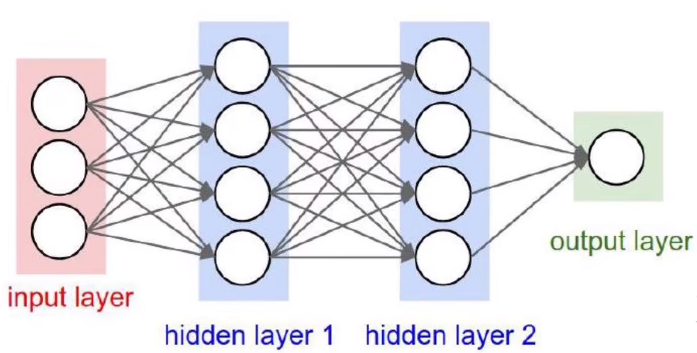
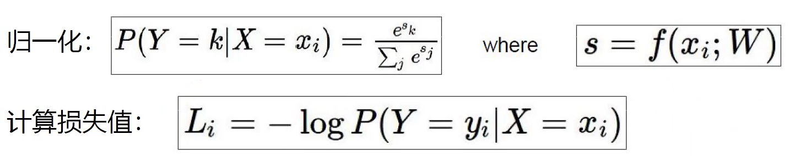

## 简介

**整体架构**

## 数据

### 预处理

- 输入数据必须先进行预处理操作
- 标准化、初始化

### 过拟合

**解决**

1. 可以使用正则化解决数据过拟合问题
2. 可以使用Drop-out解决数据过拟合问题
   - 随机杀死各层级中随机个数的神经元

## 层

### 卷积层

- 进行特征提取，用一组权重参数
- 将图像进行分割

### 池化层

#### 参数

| 参数名      | 作用               | 备注                    |
| ----------- | ------------------ | ----------------------- |
| kernel_size | 最大池的窗口大小   | n * n                   |
| stride      | 步长               | 默认是kernel_size的大小 |
| padding     | 填充输入数据的长宽 |                         |
| dilation    | 空洞               | 按指定的值间隔取数      |
| ceil_model  | 数据不完整是否取数 | true / false(默认)      |

#### 最大池化

- 取输入数据中指定区域内的最大值
- 当池化区域超出输入数据边界上，是否进行取数要看ceil_model的设置
- 作用
  - 减小输入数据的大小
  - 即取输入数据中的特征值 / 重点值

### 非线性激活层

| 函数名  | 作用 | 特点       | 场景         |
| ------- | ---- | ---------- | ------------ |
| RELU    | 非负 | x轴不小于0 | 隐藏层       |
| Sigmoid |      |            | 二分类输出层 |
|         |      |            |              |

### 线性层

- 公式：y = kx + b
  - k：权重
  - b：偏执

### 正则化层

- 

### Transformer层

## 函数

### 得分函数/线性函数

- 数学表示：f(X,W) = WX + b
  - X：类别
  - W：得分/权重/特征，是一个矩阵
  - b：偏执参数，相当于对数值微调，几个w就有几个b
- 求每个类别对应的得分

### 损失函数

- 用于计算实际输出和目标之间的差距
- 为更新输出提供一定的依据（反向传播）
- 损失函数的值相同并不意味两个模型相同，需要添加正则化惩罚项
- 可以简单计算错误得分 - 正确得分 + 容忍值

### 激活函数

- Sigmoid：非线性，已弃用，梯度难以计算，梯度消失问题
- Relu：线性，梯度好算
- Tanh：

## 传播

### 正向 / 前向传播

- 通过得分函数计算出损失值

### 反向传播

- 通过损失值修改得分函数中的权重w
- 链式法则
  - 从后往前逐层求偏导

- 门单元
  - 加法门：均等分配
  - MAX门：取最大的
  - 乘法门：互换

## 优化器

| 优化器名         | 参数           | 作用 | 方法 |
| ---------------- | -------------- | ---- | ---- |
| SGD 随机梯度下降 | 模型、学习速率 |      |      |

## Softmax分类器

### 步骤

1. 先进行exp运算，放大数据差异化，指数增长，x越大值越大，x越小值越接近0
2. 在进行归一化，得出结果得分的概率值
3. 使用对数函数，传入概率值，求正确项的损失值

