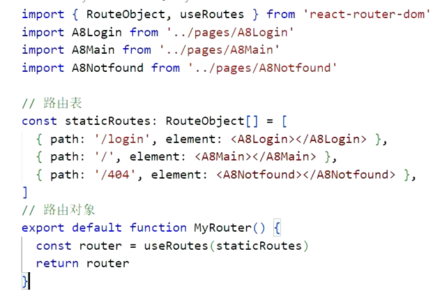

## 简介

- 所有的功能都是以组件的形式存在
- 用函数作为组件，需要导入导出才能使用
- 导入组件时可以起别名
- 组件标签使用驼峰命名法

## 使用

1. 创建脚手架项目
   - npx create-react-app  client
2. 进入项目
   - cd client 
3. 启动
   - npm start

## 格式

```react
import React from 'react';
import ReactDOM from 'react-dom/client';

const root = ReactDom.createRoot(
  document.getElementById('root') as HTMLElement
);
root.render(
  <React.StrictMode>

  </React.StrictMode>
)
```

## 函数

### 形式

```react
//创建并导出
export default function 函数名(参数名1:参数类型, 参数名2?:参数类型) {
    return (
    	html标签/对象
    )
}
//使用
import 别名 from '函数地址/函数名';
<函数名 参数名=""></函数名>
```

- 使用时参数是字符串类型直接使用引号赋值，其他类型使用{}赋值
- 在参数名后加 `?` 表示参数可选，可以有默认值直接在后面加 `=默认值`
- 参数可以是对象，也可以是数组，数组对象

  - 数组对象需要在参数位置声明为解构表达式

    ```react
    //格式一
    interface Student{
     	...   
    }
    {student}:{sttudent:Student}
    //格式二
    {student}:{sttudent:{属性1:类型，属性2:类型，...}}
    ```

- 放回的html元素如果需要块标签可以直接使用`<>html标签/对象</>`

### 钩子函数

| 函数名     | 作用                                 | 参数               | 返回值         | 备注                                                         |
| ---------- | ------------------------------------ | ------------------ | :------------- | ------------------------------------------------------------ |
| useState   | 为数据赋初始值，改变时会触发重新渲染 | 数据初始值         | 数据，数据方法 | 数据方法可以直接修改值；<br />也可以使用箭头函数修改值，参数为旧值，返回值是新值（不能是旧值 ） |
| useEffect  | 在html真正渲染之前执行函数           | 箭头函数，[依赖项] |                | 依赖性变化，函数执行，依赖项为空则函数只执行一次             |
| useContext | 存储上下文公共属性                   | 公共属性           | 公共属性值     | 使用createContext(属性)创建公共属性，使用<公共属性.Provider value={}>修改公共属性的值 |
|            |                                      |                    |                |                                                              |

## 接口

```react
interface 接口名{
    属性名:类型
    ...
}
```

- 可以用于函数参数传递，类似对象传递

## 修饰符

| 符号 | 作用            | 备注 |
| ---- | --------------- | ---- |
| :    | 类型定义 / 赋值 |      |
|      |                 |      |
|      |                 |      |

## 事件

| 事件名            | 说明         |      |
| ----------------- | ------------ | ---- |
| React.ChangeEvent | 状态改变事件 |      |
|                   |              |      |
|                   |              |      |

## Axios

| 方法 | 参数                    | 备注                 |
| ---- | ----------------------- | -------------------- |
| get  | url,[config]            | config中可以传入参数 |
| post | url,\[data\],\[config\] |                      |
|      |                         |                      |

## AntDesign

### ConfigProvider

- 国际化

  ```react
  import {ConfigProvider} from '~antd/dist/antd.css'
  import zh_cn from 'antd/es/locale/zh_CN'
  
  root.render(
      <ConfigProvider locale='zh_cn'>
  		//内容
      </ConfigProvider>
  )
  ```


## Router


