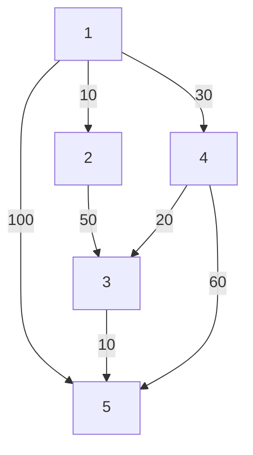
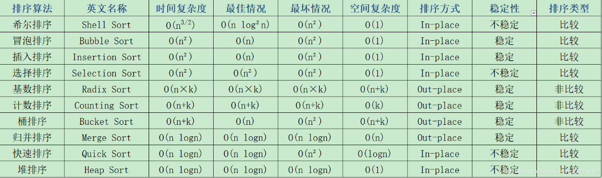

# 数据结构

## 数组

### 数组实现队列

```java
/*
    1.定义两个变量 front 和 rear 
    	- front 是队列第一个元素的前一位
    	- rear 是最后一个元素的位置
    2.front == real 表示队列为空
    3.real = maxSize - 1 表示队列已满
    4.(rear + maxSize - front) % maxSize  队列中有效数据个数
*/
```

### 数组实现环形队列

```java
/*
    - 需要两个变量 front 和 rear 
      - front 是队列第一个元素
      - rear 是最后一个元素的下一个位置
    - front == real 表示队列为空
    - (rear+1) % maxSize == front  表示队列已满
*/
```

## 链表

### 跳表

## 字符串

### KMP

```java
public int strStr(String haystack, String needle) {
    int[] next = getNext(needle);
    int s1 = 0;
    int s2 = 0;
    while(s1 < haystack.length() && s2 < needle.length()){
        if(haystack.charAt(s1) == needle.charAt(s2)){
            s1++;
            s2++;
        }else if(next[s2] == -1){
            s1++;
        }else{
            s2 = next[s2];
        }
    }
    return s2 == needle.length() ? s1-s2 : -1;
}
public int[] getNext(String str){
    if(str.length() == 1) return new int[]{-1};
    int[] res = new int[str.length()];
    res[0] = -1;
    res[1] = 0;
    int i = 2;
    int cn = 0;
    while(i < res.length){
        if(str.charAt(i - 1) == str.charAt(cn)){
            res[i++] = ++cn;
        }else if(cn > 0){
            cn = res[cn];
        }else{
            res[i++] = 0;
        }
    }
    return res;   
}
```

### Manacher

```java
//将字符串变为例如：#a#a#a# 的样子
public static char[] manacherString(String str){
    char[] charArr = str.toCharArray();
    char[] res = new char[str.length() * 2 + 1];
    int index = 0;
    for(int i = 0; i != res.length; i++){
        res[i] = (i & 1) == 0 ? '#' : charArr[index++];
    }
    return res;
}
public static int maxLcpsLength(String s){
    if(s == null || s.length() == 0) return 0;
    //s变成 #s#s#s#
    char[] str = manacherString(s);
    //回文半径数组
    int[] pArr = new int[str.length];
    int R = -1; //回文右边界再往右一个位置
    int C = -1; //中心
    int max = Integer.MIN_VALUE;
    for(int i = 0; i != str.length; i++){
        //不用验的区域
        pArr[i] = R > i ? Math.min(pArr[2 * C - i], R - i) : 1;
        //从不用验的区域往外验
        while(i + pArr[i] < str.length && i - pArr[i] > -1){
            if(str[i + pArr[i]] == str[i - pArr[i]]){
                pArr[i]++;
            }else{
                break;
            }
        }
        if(i + pArr[i] > R){
            R = i + pArr[i];
            C = i;
        }
        max = Math.max(max, pArr[i]);
    }
    return max - 1;
}
```

### 确定有限状态自动机

- 是一类计算模型，它包含一系列状态，可以同时具有多个状态
  - 初始状态：一开始都是初始状态
  - 接收状态：自动机处于某个[接受状态]，则判定该字符串[被接受]，反之[被拒绝]
- 当自动机处于接收状态时，然后依据[转移规则]，接送一个字符并转移到下一个状态，如果成功转移则说明改字符[被接受]，反之[被拒绝]
- 自动机可以看作是一种暴力枚举，它穷尽了每一种可能
- 自动机在算法领域，它与大名鼎鼎的字符串查找算法「KMP」算法有着密切的关联；在工程领域，它是实现「正则表达式」的基础

## 栈

### 单调栈

```java
/*
    - 找距离当前位置最近大的
    - 栈内元素保证从大到小，数据依次进入栈
    - 当前元素比栈内元素大时，依次弹出栈内元素
      - 当前元素（右边最近大的）  > 栈内元素 < 栈内元素上一位（左边最近大的） 
    - 当所有元素遍历完了栈内还有元素时所有元素依次出栈
      - 无 > 栈内元素 < 栈内元素上一位（左边最近大的） 
*/
```

## 二叉树

### 遍历

```java
//前中后序遍历
static List<Integer> result = new Arraylist<>();
public void Iterater(TreeNode node){
    if(node == null ) return;
    //前序
    result.add(node.val);
    if(node.left != null) Iterater(node.left);
    if(node.right != null) Iterater(node.right);
    //中序
    if(node.left != null) Iterater(node.left);
    result.add(node.val);
    if(node.right != null) Iterater(node.right);
    //后序
    if(node.left != null) Iterater(node.left);
    if(node.right != null) Iterater(node.right);
    result.add(node.val);
}
//层序遍历
public List<Integer> postorderTraversal(TreeNode root) {
    List<Integer> result = new LinkedList<>();
    Stack<TreeNode> st = new Stack<>();
    if (root != null) st.push(root);
    while (!st.empty()) {
        TreeNode node = st.pop();
        if (node != null) {
            //根据前中后序变换位置即可
            //前序：右左中 中序：右中左 后序：中右左
            st.push(node);// 添加中节点
            st.push(null); // 中节点访问过，但是还没有处理，加入空节点做为标记。
            
            if (node.right!=null) st.push(node.right);  // 添加右节点
            if (node.left!=null) st.push(node.left);    // 添加左节点
            
        } else { // 只有遇到空节点的时候，才将下一个节点放进结果集
            node = st.pop();    // 重新取出栈中元素
            result.add(node.val); // 加入到结果集
        }
    }
    return result;
}
```

### 平衡二叉树

### 搜索树

### 哈夫曼树

### 字典树（前缀树）

### B-tree

```java
/*
    以一个5阶B树为例
    - 一个节点最多有4个key，5个分支
    - 当插入一个节点使当前节点大于4时，该节点会把当前节点的中间值向上分裂
*/
```

### B+tree

```java
/*
    - 所有数据都保存在叶子节点，叶子节点之间形成单向链表
    - mysql中的B+tree叶子节点之间是双向环形链表
    - 非叶子节点作为索引，不存储数据

    - 以一个5阶B+树为例
      - 一个节点最多有4个key，5个分支
      - 当插入一个节点使当前节点大于4时，该节点会把当前节点的中间值向上分裂
      - 分裂后叶子节点会保留分裂出去的节点值
*/
```

### 红黑树

```java
/*
    - 每条路径上的黑色节点数要一致（黑色平衡）
    - 根节点是黑色的
    - 新增的节点都是红色的
    - 叶子节点都是null节点且为黑色
    - 不存在连续的红色
*/
```

### 线索二叉树

```java
/*
Morris遍历
    - 记录当前节点（cur）
      - 有左孩子
        - 左孩子的最右孩子指向null，改指向当前节点，cur = cur.left
        - 左孩子的最右孩子指向当前节点，改指向null，cur = cur.right
      - 无左孩子，cur = cur.right
    - 时间复杂度：O(n)，空间复杂度：O(1)
*/
```

## 哈希表

### 布隆过滤器

```java
/*
    - 用一个bitmap存放，多个hash算法计算
    - 作用是检索一个元素是否在一个集合中
    - 存在误判，误判率和数组大小和hash算法数有关
*/
```

## 图

### 邻接表

- 点到能到的点的信息

### 邻接矩阵

- 每个点到其它点的距离

### 遍历

#### BFS（宽度优先遍历）

```java
public static void bfs(Node node){
    
}
```

#### DFS（深度优先遍历）

```java
public static void dfs(Node node){
    
}
```

### 并查集

```java
//封装
class Element<V>{
    public V value;
    public Element(V value){this.value = value;}
}
//创建并查集
class UnionFindSet<V>{
    public HashMap<V, Element<V>> elementMap;
    public HashMap<Element<V>, Element<V>> fatherMap;
    public HashMap<Element<V>, Integer> sizeMap;
    //初始化操作
    public UnionFindSet(List<V> list){
        elementMap = new HashMap<>();
        fatherMap = new HashMap<>();
        sizeMap = new HashMap<>();
        for(V value : list){
            Element<V> element = new Element<V>(value);
            elementMap.put(value, element);
            fatherMap.put(element, element);
            sizeMap.put(element, 1);
        }
    }

    //防止找到父元素路径太长，每次查找都让路径上的元素直接z
    private Element<V> findHead(Element<V> element){
        Stack<Element<V>> path = new Stack<>();
        while(element != fatherMap.get(elementMap)){
            path.push(element);
            element = fatherMap.get(element);
        }
        while(!path.isEmpty()){
            fatherMap.put(path.pop(), element);
        }
        return element;
    }

    public boolean isSameSet(V a, V b){
        if(elementMap.containsKey(a) && elementMap.containsKey(b)){
            return findHead(elementMap.get(a)) == findHead(elementMap.get(b));
        }
        return false;
    }

    public void union(V a, V b){
        if(elementMap.containsKey(a) && elementMap.containsKey(b)){
            Element<V> af = findHead(elementMap.get(a));
            Element<V> bf = findHead(elementMap.get(b));
            if(af != bf){
                Element<V> big = sizeMap.get(af) >= sizeMap.get(af) ? af : bf;
                Element<V> small = big == af ? bf : af;
                fatherMap.put(small, big);
                sizeMap.put(big, sizeMap.get(af) + sizeMap.get(bf));
                sizeMap.remove(small);
            }
        }
    }
}
```

### 最短路径

#### 迪杰斯特拉算法



| 迭代 | S               | u    | dist[2] | dist[3] | dist[4] | dist[5] |
| ---- | --------------- | ---- | ------- | ------- | ------- | ------- |
| 初始 | {1}             | -    | 10      | +∞      | 30      | 100     |
| 1    | {1，2}          | 2    | 10      | 60      | 30      | 100     |
| 2    | {1，2，4}       | 4    | 10      | 50      | 30      | 90      |
| 3    | {1，2，4，3}    | 3    | 10      | 50      | 30      | 60      |
| 4    | {1，2，4，3，5} | 5    | 10      | 50      | 30      | 60      |

```java
/*
    - 属于贪心算法
    - 动态维护一个数组，记录到各个点的最短路径
*/
public static int[] dijkastra(int[][] graph, int startPointIndex) {
    //集合s表示，已经求出最短路径的点的集合
    boolean[] s = new boolean[graph.length];
    //初始化s集合，只有起始点为true
    for (int i = 0; i < graph.length; i++) {
        s[i] = (i == startPointIndex);
    }
    //最短路径集合
    int[] dis = new int[graph.length];
    //初始化，起始点到其他点的距离
    for (int i = 0; i < graph.length; i++) {
        dis[i] = graph[startPointIndex][i];
    }
    //求到每个点的最短路径
    for (int i = 0; i < graph.length; i++) {
        int tmpdis = max;
        int tmpindex = 0;
        for (int j = 0; j < graph.length; j++) {
            //不在s集合(未求出该点的最短路径)
            if (!s[j] && dis[j] < tmpdis) {
                tmpdis = dis[j];
                tmpindex = j;
            }
        }
        //dis中距离最短的点加入到s集合中
        s[tmpindex] = true;
	    //更新起点到其他点距离
        for (int j = 0; j < graph.length; j++) {
            if (dis[j] > dis[tmpindex] + graph[tmpindex][j]) {
                dis[j] = dis[tmpindex] + graph[tmpindex][j];
            }
        }
    }
    return dis;//返回起点到每个点的最短路径长度
}
```

#### 弗洛伊德算法（Floyd）

```java
/*
    - 属于动态规划
    - 直接算出距离
    - 路径负权值也可以计算，但是要求图中不能有负环（）
*/
private  int[][]  floyd(Graph graph){

    int[][] dis = new int[graph.vertexNum][graph.vertexNum];

    for (int i = 0; i < graph.vertexNum; i++) {
        for (int j = 0; j < graph.vertexNum; j++) {

            if (graph.graphMatrix[i][j] == 0){
                //是邻边将dis数组填充为权值最大值的2倍
                dis[i][j] = Math.min(graph.maxWeight<<1, Integer.MAX_VALUE);
            }
            else {
                dis[i][j] = graph.graphMatrix[i][j];
            }

            if (i == j ) dis[i][j] = 0;

        }
    }

    for (int k = 0; k < graph.vertexNum; k++) {//中间顶点

        for (int i = 0; i < graph.vertexNum; i++) {//i顶点

            for (int j = 0; j < graph.vertexNum; j++) {//j 顶点

                dis[i][j] = Math.min(dis[i][j], dis[i][k]+dis[k][j]);
            }

        }
    }

    return dis;
}
```

### 最小生成树

#### 克鲁斯卡尔算法

#### 普利姆算法

# 算法思想

## 排序



### 冒泡排序

### 插入排序

```java
/*
	常规实现
    - 从第一个元素开始，后一个数和前面的数比较找到合适的位置插入
    - 类似打扑克时，抽起来的牌从左往右找合适的位置
    - 在处理样本小且基本有序时效率最高
*/
public static void InsertSort(int[] arr){
    for (int i = 1; i < arr.length; i++) {
        for (int j = i; j > 0 ; j--) {
            if(arr[j]<arr[j-1])
                swap(arr,j,j-1);
        }
    }
}
/*
	二分插入
	- 就是在插入排序前用二分查找找最佳位置插入
*/
public static void midInsertSort(int[] arr){
    for(int i = 1;i < arr.length;i++){
        //如果当前位置比前一位小
        if(arr[i] < arr[i-1]){
            //保存当前位置的值
            int temp = arr[i];
            int left = 0;
            int right = i-1;
            int mid = 0;
            //二分查找，在 0 ~ i-1 范围寻找插入的位置
            while(left <= right){
                //在left到i-1位置上的中间值mid
                mid = left+(right-left)/2;
                //如果i位置上的值 等于 mid值，返回mid
                if(temp == arr[mid]){
                    left = mid;
                    break;
                }
                //以下都是缩小边界，直到找到合适的插入位置
                else if(temp < arr[mid]){
                    right = mid -1;
                }else{
                    left = mid + 1;
                }
            }
            //如果二分查找在left 到 i-1 位置上都没有找到合适的插入位置
            //即说明 i 的位置已经是合适的位置，不用进行插入操作
            //插入排序（优化插入过程）
            for(int j = i-1;j >= left;j--){
                arr[j+1]=arr[j];
            }
            arr[left] = temp;
        }
    }
}
/*
	优化
	- 不用每次都要交换位置，整体后挪再插入
*/
public static void Optimization(int[] arr){
    for (int i = 1; i < arr.length; i++) {
        //tem保存i位置上的值
        int tmp = arr[i];
        //j用于保留插入的位置
        int j;
        for (j = i; j > 0 && arr[j - 1] > tmp;j--)
            arr[j] = arr[j-1];
        arr[j] = tmp;
    }
}
```

### 选择排序

```java
/*
	常规实现
	- 找最值的位置，和未排序的第一个位置交换
	- 基本不用，不稳定
*/
public static void SelectionSort(int[] arrays){
    for (int i = 0; i < arrays.length-1; i++) {
        int minPos = i;
        for (int j = i + 1; j < arrays.length; j++) {
            minPos = arrays[j] < arrays[minPos] ? j : minPos;
        }
        swap(arrays,i,minPos);
    }
}
/*
	优化
	- 同时找最大值和最小值
	- 在数组两端排序，时间减半，但时间复杂度还是O(N^2^)
*/
```

### 快速排序

```java
/*
	快速排序是常规排序中速度最快的，快速排序最好的时间复杂度是 O(nLogn)，因为它的内部循环（inner loop）可以在大部分的架构上很有效率地被实现出来,所以快速排序通常比其他 Ο(nLogn) 算法更快，算法的思想也是比较简单直观的，就是给要排序的元素找合适的位置，把比这个元素大的放右边，小的放左边，就找到了该元素的位置，运用到了分治的思想，快速排序的最坏运行情况是 O(n²)，比如说顺序数列的快排，但它的平摊期望时间是 O(nLogn)，且 O(nLogn) 记号中隐含的常数因子很小，比复杂度稳定等于 O(nLogn) 的归并排序要小很多。所以，对绝大多数顺序性较弱的随机数列而言，快速排序总是优于归并排序。
*/
//普通递归处理
public static void Sort(int[] arr, int left, int right) {
    if (left >= right) return;
    //将排序后的元素确定了的位置作为下一轮排序的边界
    int pivot = move(arr, left, right);
    Sort(arr,left,pivot-1);
    Sort(arr,pivot+1,right);
}

//基础实现
public static int BasicSort(int[] arr, int leftBound, int rightBound) {
    // 设定基准值（pivot）
    int pivot = leftBound;
    //小于基准值的区域的左指针
    int left = pivot + 1;
    for (int i = left; i <= rightBound; i++) {
        //i位置的值小于基准值则移动到左边（left）
        if (arr[i] < arr[pivot]) {
            swap(arr, i, left);
            left++;
        }
    }
    swap(arr, pivot, left - 1);
    return left - 1;
}
//双路快排
public static int TwoRoadSort(int[] arr, int leftBound, int rightBound) {
    //选数组最右作为基准值
    int pivot = arr[rightBound];
    int left = leftBound;
    int right = rightBound - 1;
    while (left <= right) {
        while (left <= right && arr[left] <= pivot) left++;
        while (left <= right && arr[right] > pivot) right--;
        if (left < right) swap(arr, left, right);
    }
    swap(arr, left, rightBound);
    return left;
}
//三路快排
public static int ThreeRoadSort(int[] arr, int leftBound, int rightBound) {
    //使用了三数取中，放在数组最左作为基准值
    int pivot = ThreeNumSelect(arr, leftBound, rightBound);
    //left指针用于记录小于基准值的区域
    int left = leftBound
    //right指针用于记录大于基准值的区域
    int right = rightBound;
    //mid指针用于记录等于基准值的区域，同时也是遍历的指针
    int mid = left + 1;
    while(mid <= right){
        if(arr[mid] < pivot){
            //小于基准值的就放在小于区，即left+1的位置，然后left++；
            swap(arr,mid,left+1);
            left++;
            mid++;
        }else if (arr[mid] > pivot){
            //大于基准值的就放在right的位置上，right--
            //此时mid位置上的不确定其大小，需要在下次循环时判断
            swap(arr,mid,right);
            right--;
        }else{
            //等于基准值的则放在mid区，mid++即可
            mid++;
        }
    }
    //最后交换基准和left的位置，当前left的值是小于基准值的
    swap(arr,leftBound,left);
    //返回基准值的位置，作为递归调用的边界值
    return left;
}

/*	
	优化：主要通过优化基准的选择来达到算法的优化，处理降序数组时优化明显，1.采用三数选中，比如数组A = {6，1，3，4，6，7，9 }，取三数分别是：6，4，9  将他们排序后取6作为基准。2.当待排序的数列分割到一定大小时使用插入排序，插入排序在处理样本小且基本有序的数组时效率最高。3.使用尾递归，减少栈的深度，可以处理更多的数据。4.使用位运算优化交换过程
*/
//三数取中
public static void ThreeNumSelect(int[] arr, int low, int high) {
    int mid = low + (high - low) / 2;
    //标记是否发生交换
    int flag = 0;
    // 下面两步保证了arr[high]是最大的
    if (arr[mid] > arr[high]) {
        swap(arr, mid, high);
    }
    if (arr[low] > arr[high]) {
        swap(arr, low, high);
    }
    // 将arr[low]和arr[mid]比较，让较小的在arr[low]的位置
    if (arr[low] > arr[mid]) {
        flag = 1;
        swap(arr, mid, low);
    }
    //数组中间值有发生交换位置的时候才执行
    //将中间值移到数组d一位
    if (flag == 1) swap(arr, mid, high);
}
//优化插入
if (left - right + 1 < 10) {
    InsertSort(arr);
    return;
}
//尾递归
while(left < right) {
    pivot = move(arr, left, right);
    Sort(arr, left, pivot - 1);
    left = pivot + 1;
}
//位运算优化交换过程
public static void swap(int[] arrays, int i, int j) {
    //由于位运算如果操作同一块内存区域会将此区域变为0
    if (i==j) return;
    arrays[i] = arrays[i] ^ arrays[j];
    arrays[j] = arrays[i] ^ arrays[j];
    arrays[i] = arrays[i] ^ arrays[j];
}
```

### 归并排序

```java
/*
	归并排序，顾名思义就是递归+合并，这是常见的一种实现，他还有一种基于循环的实现方式,归并排序重要的是他的合并，将数组分成两份，排序左右后合并,合并用双指针，比较俩边大小依次写入辅助数组,Java中的对象排序就是用的归并排序，对象排序要求稳定
*/
//基础实现
public static void Sort(int[] arr,int left,int right){
    if(left == right) return;
    int mid = left + (right - left)/2;
    //拆分数组
    Sort(arr,left,mid);
    Sort(arr,mid+1,right);
    //归并数组
    //优化：数组左右已经有序了就不用进行合并了
    if(arr[mid] < arr[mid+1]) return;
    merge(arr,left,mid+1,right);
}
//合并的过程就是两个数组一一比较元素，小的放进临时数组
public static void merge(int[] arr, int left, int right, int bound){
    //左半边数组的边界
    int mid = right - 1;
    //创建一个辅助数组，作为形参传进来会更好
    int[] tmp = new int[bound-left+1];
    int i = left,j = right,k = 0;
    //比较元素大小
    while(i<=mid && j <= bound){
        if(arr[i] <= arr[j]){
            tmp[k++] = arr[i++];
        }else{
            tmp[k++] = arr[j++];
        }
    }
    //循环结束后左半边数组还有剩余元素，依次存入临时数组
    while(i<= mid) tmp[k++] = arr[i++];
    //循环结束后右半边数组还有剩余元素，依次存入临时数组
    while(j<= bound) tmp[k++] = arr[j++];
    //将排序结束后的临时数组复制到原数组
    for (int l = 0; l < tmp.length; l++) arr[left++] = tmp[l];
}
//优化
//1.当待排序的数列组分割到一定大小时使用插入排序
if (left - right + 1 < 10) {
    InsertSort(arr);
    return;
}
//2.待排序的数组左右已经有序了就不用进行合并了
if(a[mid] < a[mid+]) return;
```

### 基数排序

```java
/*
	我们都知道，大部分的排序算法都是数与数之间做比较，而基数排序可以算是一种桶排序的推广，它不是基于元素之间的比较，而是利用数组下标，统计数组元素各个进位数出现的次数
	例如：
 		数组 A = {312，006，211，125，032，020，203，523}
		数组 B 要先记录元素个位数各个数组出现的次数
			第一次 B = {1, 1, 2, 2, 0, 1, 1, 0, 0, 0}    个位数
			第二次 B = {2, 2, 3, 1, 0, 0, 0, 0, 0, 0}    十位数
			第三次 B = {3, 1, 2, 1, 0, 1, 0, 0, 0, 0}    百位数
		累加数组：
			第一次 B = {1, 2, 4, 6, 6, 7, 8, 8, 8, 8}    个位数
			第二次 B = {2, 4, 7, 8, 8, 8, 8, 8, 8, 8}    十位数
			第三次 B = {3, 4, 6, 7, 7, 8, 8, 8, 8, 8}    百位数
		累加数组的值代表对应下标的元素在数组中的位置
	基数排序适合元素范围比较均匀的数组,本质上是一种多关键字排序，属于分配式排序,属于稳定的算法,有低位优先和高位优先,低位优先是先排个位数,高位优先是先排最高位，是一种分治思想，用递归来做
*/
//低位优先
//maxlen用getMaxLen方法求得
public static void Sort(int[] arr, int maxLen) {
    //桶
    int[] bucket = new int[10];
    int[] result = new int[arr.length];
    for (int i = 0; i < maxLen; i++) {
        for (int j = 0; j < arr.length; j++) {
            int num = (int) (arr[j] / Math.pow(10, i)) % 10;
            //得出各个位数的数有几个
            bucket[num]++;
        }
        //累加数组
        for (int k = 1; k < bucket.length; k++) {
            if (bucket[k] == 0) {
                int left = k - 1;
                int right = k + 1;
                int Time = 0;
                while (bucket[left] == 0) {
                    left--;
                }
                while(right<bucket.length && bucket[right] == 0){
                    Time++;
                    right++;
                }
                if (right < bucket.length) {
                    bucket[right] = bucket[right] + bucket[left];
                }
                k = k + Time;
                continue;
            }
            bucket[k] = bucket[k - 1] + bucket[k];
        }
        //复制结果
        for (int l = arr.length-1; l >= 0; l--) {
            int num = (int) (arr[l] / Math.pow(10, i)) % 10;
            result[bucket[num]-1] = arr[l];
            bucket[num]--;
        }
        Arrays.fill(bucket,0);
        for (int j = 0; j < arr.length; j++) {
            arr[j] = result[j];
        }
    }
}
 //计算数组中元素最大位数
public static int getMaxLen(int[] arr) {
    int maxLen = 0;
    for (int i = 0; i < arr.length; i++) {
        String str = String.valueOf(arr[i]);
        if (str.length() > maxLen) maxLen = str.length();
    }
    return maxLen;
}
```

### 计数排序

```java
/*
	我们都知道，大部分的排序算法都是数与数之间做比较，而计数排序可以算是一种桶排序的推广，它不是基于元素之间的比较，而是利用数组下标，统计对应下标的数字出现的次数
	例如：
		数组 A = {0，0，1，1，2，2，3，3}
		对应的数组 B = {2，2，2，2} ，因为每个数都出现了两次
	我们想将A从大到小排列，只需要将B 逆序遍历即可，B[3] 输出 2次，B[2] 输出两次，依次类推，即可得到 A的降序排列,计数排序适合量大但是范围小的数组，比如一个公司中员工的年龄，高考成绩排名等等,计数排序的时间复杂度：O(N+K)，空间复杂度：O(N+K)
*/
//基础实现
public static void Sort(int[] arr){
    //找出最大值和最小值,解决空间浪费	
    int min = 0,max = 0;
    for (int i = 0; i < arr.length; i++) {
        if(arr[i]<min) min = arr[i];
        if(arr[i]>max) max = arr[i];
    }
    //算出每个数字出现的次数
    int[] bulk = new int[max-min+1];
    for (int i = 0; i < arr.length; i++) {
        bulk[arr[i]-min]++;
    }
    //将统计好的数组赋值给原数组
    int i = 0,k = 0;
    while(i<bulk.length){
        if(bulk[i] > 0 ){
            arr[k++] = i;
            bulk[i]--;
        }
        if(bulk[i] <= 0) i++;
    }
}
/*
	优化：
		常规写法会有一个问题，就是在对象排序时是不稳定的，下面是它的优化版本，但是优化版本执行速度会慢一丢丢，但是稳定了，实现稳	定的方式是用一个累加数组，将辅助数组（即存放元素出现次数的那个数组）中的值累加起来
	例如：
		辅助数组B：{2，3，4，5}   
		累加数组C：{2，5，9，13}
		结果数组R：{0，0，1，1，1，2，2，2，2，3，3，3，3，3}
	累加数组的含义就是其下标在结果数组中最后出现的位置
*/
public static int[] Optimization(int[] arr){
    int[] result = new int[arr.length];
    //算出最大最小值
    int max = arr[0], min = arr[0];
    for (int i = 0; i < arr.length; i++) {
        if(arr[i]>max) max = arr[i];
        if(arr[i]<min) min = arr[i];
    }
    //算出每个数字出现的次数
    int[] bulk = new int[max-min+1];
    for (int i = 0; i < arr.length; i++) {
        bulk[arr[i]-min]++;
    }
    //算出累加数组，即每个数出现的最后一个下标
    for (int i = 1; i < bulk.length; i++) {
        //如果当前下标对应的值为0
        //则需要把他左边最近一次出现的值和右边最近出现的值相加
        //并把指针指向右边最近出现值的位置
        if(bulk[i] == 0){
            int left = i - 1;
            int right = i + 1;
            //用于记录右移的几次
            int Time = 0; 
            //这段左移可以删除，实际上没有执行到
            //但是为了看的比较直观建议留着
            while(bulk[left] == 0){
                left--;
            }
            //右移找最近出现的值的下标
            while(bulk[right] == 0){
                //右移一次就加一
                Time++;
                right++;
            }
            bulk[right] = bulk[right] + bulk[left];
            //把下标移到右边最近出现的值，然后跳出本轮循环
            i = i+Time;
            continue;
        }
        //当前的值等于自己的值加前一个的值
        bulk[i] = bulk[i-1] + bulk[i];
    }
    //结果复制到一个新数组再返回
    for (int i = arr.length-1; i >= 0; i--) {
        result[ bulk[ arr[i]-min ]-1 ] = arr[i];
        bulk[ arr[i]-min ]--;
    }
    return result;
}
```

### 希尔排序

```java
/*
	希尔排序又称为缩小增量排序，是对插入排序进行了改进,插入排序如果刚好要插入的位置较远，移动和比较的次数比较大,希尔排序在这上面进行了优化,在间隔大的时候移动的次数少，间隔小移动的距离近,具体实现就是把数组按gap分割，把gap上的数排序，再缩小gap再排序，直到gap=1,gap的取值一般选用 gap = 3n+1 较好
*/
//基础实现
public static void sort(int[] arr){
    int h = 1;
    while(h<=arr.length/3){
        h = 3*h + 1;
    }
    for (int gap = h; gap > 0 ; gap = (gap-1)/3) {
        for (int i = gap; i < arr.length; i++) {
            for (int j = i; j > gap-1 ; j-=gap) {
                if(arr[j]<arr[j-gap])
                    swap(arr,j,j-gap);
            }
        }
    }
}
//优化
//把内部的插入排序优化
public static void Optimization(int[] arr){
    int h =0;
    while(h<=arr.length/3){
        h = 3 * h + 1;
    }
    for (int gap = h; gap > 0 ; gap=(gap-1)/3) {
        for (int i = gap; i < arr.length; i++) {
            int tmp = arr[i];
            int j;
            for ( j = i; j > gap-1 && arr[j - gap] > tmp;j=j-gap){
                arr[j] = arr[j-gap];
            }
            arr[j] = tmp;
        }
    }
}
```

### 堆排序

```java
/*
	堆结构是一颗完全二叉树，堆排序的规则是每个节点的值都要大于或等于它的左右孩子节点，称为大顶堆，反之则称为小顶堆,java中的优先级队列就是小根堆结构 (PriorityQueue<T>),将数组看出一个堆结构，使用堆排序，以下算法实现都是基于大顶堆,具体实现就是保证每一颗子树都是大顶堆，分治思想,把数组的最后一位和0位置上的值交换，然后自上而下排成大顶堆
	以 i 节点为例
		左孩子节点下标：2 * i + 1
		右孩子节点下标：2 * i + 2
 		父亲节点下标：(i-1)/2
 	大顶堆的条件是 arr[i] >= arr[2 * i + 1] >= arr[2 * i + 2]
*/
//基础实现
public static void heapSort(int[] arr){
    if(arr == null || arr.length < 2) return;
    //排序成大顶堆
    for (int i = 0; i < arr.length; i++) {
        heapInsert(arr,i);
    }
    //要处理的区域
    int heapSize = arr.length;
    //交换第一个元素和最后一个元素，区域自减
    swap(arr,0,--heapSize);
    while(heapSize > 0){
        heapify(arr,0,heapSize);
        swap(arr,0, --heapSize);
    }
}

//排序大顶堆
public static void heapInsert(int[] arr, int index){
    while(arr[index] > arr[(index-1)/2]){
        swap(arr,index,(index-1)/2);
        index = (index-1)/2;
    }
}
//保证每个子树都是大顶堆
public static void heapify(int[] arr, int index, int heapSize){
    //左孩子的下标
    int left = 2 * index + 1;
    //存在孩子时
    while(left < heapSize){
        int largest = left + 1 < heapSize 
            && arr[left + 1] > arr[left] ? left + 1 : left;
        largest = arr[largest] > arr[index] ? largest : index;
        if(largest == index) break;
        swap(arr,largest,index);
        index = largest;
        left = 2 * index + 1;
    }
}
/*
	拓展
		已知一个几乎有序的数组，几乎有序是指，如果把数组排好顺序的话，每个元素移动的距离可以不超过k，并且k相对于数组来说比较小。	 请选择一个合适的排序算法针对这个数据进行排序
	假设 k=7
 		先把0~k-1的元素变成一个小根堆
 		把0位置上的数取出，加入k位置的元素，变成小根堆，然后取出1位置上的数，加入k+1位置的元素变成小根堆，循环执行
 		最后数组就排好序了，k越小时间复杂度越小
*/
```

### 桶排序

## 递归/回溯

- 本质上是一种穷举，性能不高，可以通过剪枝的方式优化性能

## 贪心算法

## 动态规划

- Dynamic Programming，简称DP，本质上就是一个数组，表示每一步的情况
- 每一个状态一定是由上一个状态推导出来的，即 dp[n] 与 dp[n - 1] 有关系
- 主要用于解决
  - 重叠子问题
  - 找最优
- 步骤
  1. 确定dp数组
     - 一维还是二维，下标的含义
  2. 确定递推公式
     - 即找到当前状态和上一个状态的关系
  3. 初始化dp数组
  4. 确定遍历的顺序
  5. 举例推导

## 
