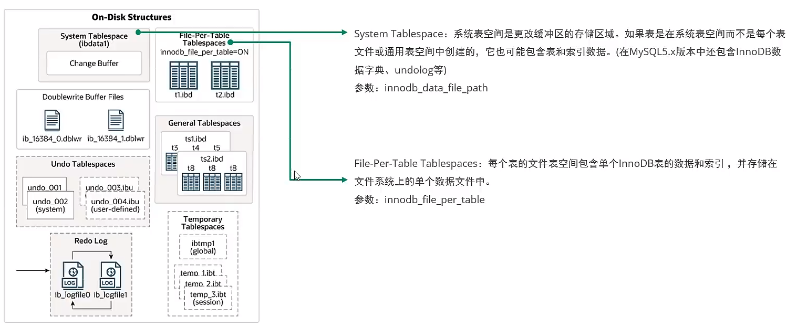
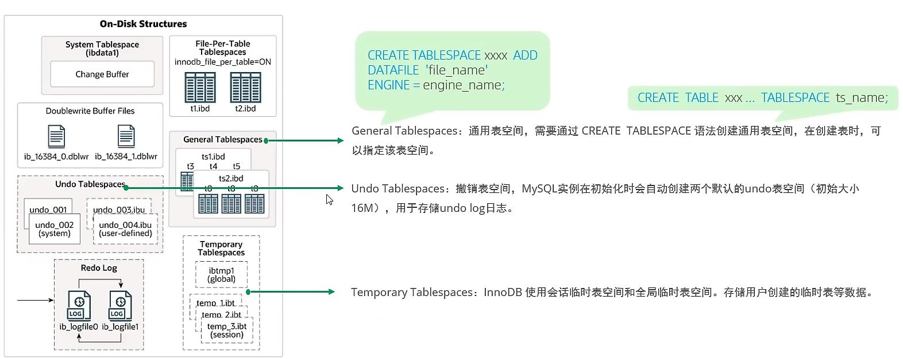
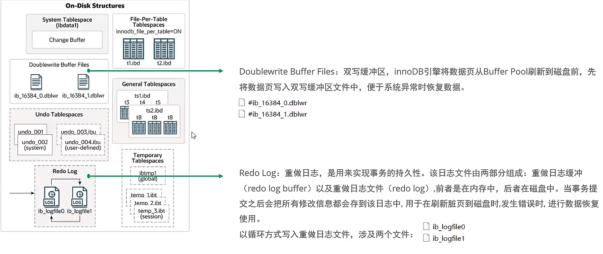
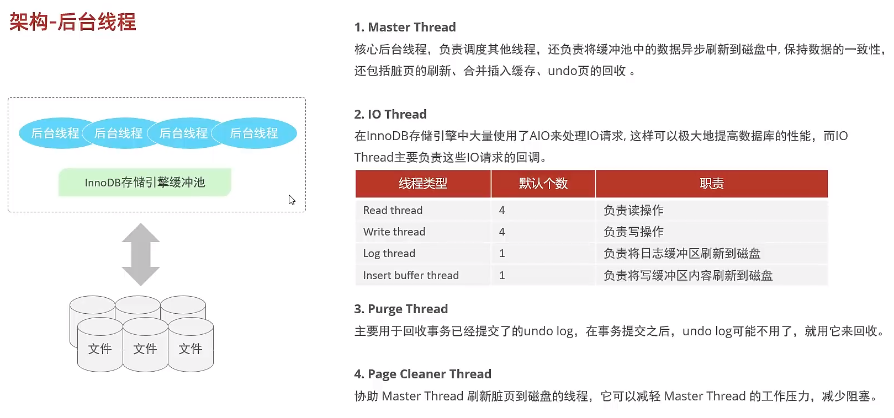

## 简介


## 命令

| 命令名                                                  | 参数                                 | 作用                     |
| ------------------------------------------------------- | ------------------------------------ | ------------------------ |
| mysql                                                   | -h 主机名 -P 端口  -u 用户名 -p 密码 | 启动数据库               |
| desc                                                    | 表名                                 | 查看表结构               |
| show variables                                          |                                      | 查看系统变量             |
| select @@transaction_isolation                          |                                      | 查看当前事务隔离级别     |
| set [global] transaction isolation level read committed |                                      | 设置数据库系统的隔离级别 |
| source                                                  | 路径                                 | 导入sql文件              |
|                                                         |                                      |                          |

## 函数

### count()

- count(1) ≈ count(*) > count(主键ID) > count(column)
  - count(*)：不同存储引擎有不同的实现和优化
    - InnoDB：
      - 一行一行的读并统计，因为InnoDB支持事务，同一时刻的多个查询会受到MVCC的控制，所以count()的结果不稳定
      - 等同于count(0) ≈ count(1)
    - MyISAM：
      - 每张表都会记录其总行数，直接返回，效率很高，由表级锁保证一致性，但如果有条件查询，效率就和InnoDB差不多了，因为要扫描表
  - count(1)：统计所有记录，包括null
    - 比count(字段)快，因为不涉及解析数据行和拷贝字段值的操作
  - count(字段)：统计字段不为null的记录数
    - 当字段为主键，并且表里只有主键索引时，InnoDB会循环遍历主键索引的B+树的叶子节点，并返回主键值，然后判断是否为null，不为null则count+1
    - 当字段为主键，并且表里有二级索引时，InnoDB会循环遍历二级索引的B+树的叶子节点，因为主键索引的B+树叶子节点存储的是实际数据，二级索引B+树叶子节点存放的是主键值，所以二级索引树比主键索引树小，遍历比较快，有多个二级索引的情况下，InnoDB会选择索引长度最小的二级索引进行扫描
    - 当字段为普通字段时，会采用全表扫描来计数

## 数据类型

| 类型           | 字节 | 参数                | 备注                                            |
| -------------- | ---- | ------------------- | ----------------------------------------------- |
| tinyint        | 1    |                     | 加unsigned  无符号整形(0, 255)，不加(-128, 127) |
| smallint       |      |                     |                                                 |
| mediumint      |      |                     |                                                 |
| int/integer    | 4    |                     |                                                 |
| bigint         | 8    |                     |                                                 |
| float          | 4    | M总长度,D小数点长度 |                                                 |
| double         | 8    | M总长度,D小数点长度 | 超出M则插入临界值                               |
| dec            |      | M总长度,D小数点长度 | 超出D则四舍五入                                 |
| decimal        |      | M总长度,D小数点长度 | 精度高                                          |
| char           |      |                     | 固定长度耗费空间，但效率高                      |
| varchar        |      |                     | 可变长度节省空间，但效率低                      |
| text / bigtext |      |                     |                                                 |
| blob           |      |                     | 较大的二级制                                    |
| binary         |      |                     | 较短的二级制                                    |
| varbinary      |      |                     | 较短的二级制                                    |
| enum           |      |                     |                                                 |
| set            |      |                     |                                                 |
| date           |      |                     | 日期                                            |
| time           |      |                     | 时间                                            |
| datetime       |      |                     | 日期+时间                                       |
| timestamp      |      |                     | 时间戳，受时区影响                              |

## 变量

### 系统变量

- 查看所有系统变量

  `show global | [session] variables`  

- 查看满足条件的系统变量

  `show global | [session] variables like ''`

- 查看指定的系统变量的值

  `select @@global | [session] 系统变量名`

- 为系统变量赋值

  `set global | [session] 系统变量名 = 值 `

  `set @@global | [session].系统变量名 = 值`

#### 全局变量

- 查看所有全局变量

  `show global variables` 

- 查看满足条件的全局变量

  `show global variables like ''`

- 查看指定的全局变量的值

  `select @@global.全局变量名`

- 为全局变量赋值

  `set @@global.全局变量名 = 值`

- 必须拥有super权限才能为系统变量赋值，作用域为整个服务器

#### 会话变量

- 查看所有会话变量

  `show session variables` 

- 查看满足条件的会话变量

  `show session variables like ''`

- 查看指定的会话变量的值

  `select @@session .会话变量名`

- 为会话变量赋值

  `set @@session .会话变量名 = 值`

  `set session 会话变量名 = 值 `

- 作用域为当前的会话/连接

### 自定义变量

#### 用户变量

- 声明并初始化

  `set @用户变量名=值:`

  `set @用户变量名:=值:`

  `select @用户变量名:=值:`

- 赋值

  `set @用户变量名=值:`

  `set @用户变量名:=值:`

  `select @用户变量名:=值:`

  `select 字段 into 用户变量名 from 表`

- 使用

  `select @用户变量名`

#### 局部变量

- 声明

  `declare 变量名 类型`

  `declare 变量名 类型 default 值`

- 赋值

  `set @局部变量名=值:`

  `set @局部变量名:=值:`

  `select @局部变量名:=值:`

  `select 字段 into 局部变量名 from 表`

- 使用

  `select @局部变量名`

- 定义只能放在begin-end中的第一句

### 游标

- 声名

  `declare 游标名称 cursor for 查询语句`

- 打开

  `open 游标名称`

- 获取游标记录

  `fetch 游标名称 into 变量[变量]`

- 关闭游标

  `close 游标名称`

### 条件处理

`DECLARE handler action HANDLER FOR condition_value [, condition_value]...statement`

- handler action
  - CONTINUE: 继续执行当前程序
  - EXIT: 终止执行当前程序
- condition value
  - SOLSTATE sglstate value: 状态码，如 02000
  - SQLWARNING: 所有以01开头的SOLSTATE代码的简写
  - NOT FOUND: 所有以02开头的SOLSTATE代码的简写
  - SQLEXCEPTION: 所有没有被SQLWARNING 或 NOT FOUND捕获的SQLSTATE代码的简写

## 事务

### 特性（ACID）

- 原子性(Atomicity)
  - 事务是一个不可分割的工作单位，要么都发生，要么都不发生
- 一致性(Consistency)
  - 事务必须使数据库从一个一致性状态变换到另外一个一致性状态
- 隔离性(Isolation)
  - 一个事务的执行不能被其他事务干扰
- 持久性(Durability)
  - 事务一旦被提交，对数据库的改变就是永久性的

### 创建事务  

- 隐式事务
  - 没有明显的开启和结束的标记
  - 如insert，update，delete

- 显式事务
  - 有明显的开启和结束的标记
  - 需要先设置自动提交功能为禁用
    - set autocommit=0;
      - 当前会话有效
  - 开启事务
    - start transaction          可选
  - 编写sql语句
  - 结束事务
    - commit            提交事务
    - rollback           回滚事务

### 可能出现的问题

- 脏读
  - T1读取了T2还没有提交的事务
- 不可重复读
  - T1俩次读取T2同一字段的值不同
- 幻读
  - T1多次读取T2同一字段返回的数据行数不同，因为T2做了插入操作

### 隔离级别

- oracle支持两种隔离级别
  - read commited            默认
  - serializable
- Mysql支持四种隔离级别
  - repeatable read              可重复读    mysql默认
    - 多次读一个字段值值相同，禁止其他事务对这个字段进行更新
    - 可避免脏读和不可重复读，仍存在幻读
  - read uncommitted         读未提交数据
    - 允许事务读取其他事务未提交的数据
    - 脏读，不可重复读，幻读都不可避免
  - read commited               读已提交的数据
    - 允许事务读取其他事务已提交的数据
    - 可避免脏读，但不可重复读和幻读不可避免
  - serializable                      串行化                       最高级别
    - 事务操作期间加锁，其他事务无法操作
    - 脏读，不可重复读，幻读都可避免
    - 性能十分低下

### SavePoint

- 搭配rollback to 使用

### delete和truncate在事务使用时的区别

- delete支持回滚，truncate不支持回滚

## 视图

### 视图的好处

- 重用sql语句
- 简化sql操作，屏蔽查询细节
- 保护数据，提高安全性
- 临时的表

### 视图的创建

`create view 视图名 as 查询语句`

- 虚拟表，和普通表一样使用
- 相当于给查询起别名

### 视图的修改

`create or replace view  视图名 as 查询语句`

`alter view 视图名 as 查询语句`

### 删除视图

`drop view 视图名，视图名,...`

### 查看视图

`desc 视图名`

`show create view 视图名`

### 视图的更新

- 视图插入数据原表也会插入
- 视图插入数据需要原表和视图都要有相同的字段
- 视图可以增删改，原始表会受到影响，一般很少会这样用
- 视图一般会添加权限，只可读不可写
- 具备以下特点的视图不允许更新
  - 包含分组函数，distict，group by，having，union/union all
  - 常量视图
    - select 常量
      - select 'john' name；
  - Select中包含子查询
  - 连接（join）
    - 可以更改数据
  - from后是一个不能更新的视图
  - where子句的子查询引用了from子句中的表

### 视图的检查

- MySQl允许在一个视图上再创建一个视图，为了保证两个视图的一致性，提供了两个属性检查方式

- `创建包含视图的视图语句 + with cascaded check option`
  - 级联，对其依赖的视图或表也有约束，需要同时满足两条语句的规则


- `创建包含视图的视图语句 + with local check option`
  - 仅检查当前语句


## 存储过程

### 作用

- 减少网络交互提升效率

### 用法

```sql
create procedure 存储过程名(参数列表)
begin
	合法的sql语句
end
```

- 参数列表包含三部分：参数模式，参数名，参数类型
  - 参数模式
    - in	   作为输入，需要传值
    - out    作为输出，即返回值
    - inout 既是输入，也是输出
- delimiter 结束标记
  - 修改结束标记为指定的结束符号
- 调用
  - `call 存储过程名(实参列表)`
- 删除
  - `drop procedure 存储过程名`
- 查看存储过程的信息
  - `show create procedure 存储过程名`
- 注意
  - 如果方法体只有一句话，可以省略begin end语句
  - 方法体中每条sql结尾都需要加分号

## 存储函数

```sql
create function 函数名(参数列表) returns 返回类型
begin
	函数体
end
```

### 调用

- `select 函数名(参数列表)`

### 查看

- `show create function 函数名`

### 删除

- `drop function 函数名` 

### 注意

- 有且仅有一个返回值
- 参数列表包含二部分：参数名，参数类型
  - 参数列表只能是int类型


## 循环结构

### 分类

- while

  ```sql
  while 循环条件 do
  	循环体;
  end while;
  ```

- loop

  ```sql
  循环名:loop
  	循环体;
  	iterate / leave 循环名
  end loop;
  ```

  - iterate
    - 相当于continue;
  - leave
    - 相当于break; 

- repeat

  ```sql
  repeat
  	循环体;
  until 结束循环的条件
  end repeat;
  ```

## InnoDB引擎

### 逻辑存储结构

- 表空间：存记录、索引
- Segment段：数据段（叶），索引段（非叶）、回滚段
- Exten区：1M，64页，会申请4-5个区
- Page页：16kb，最小单元，操作都是以页为单位的
- Row行：数据

### 内存架构

- BufferPoll 缓冲池
  - 默认是128m，使用hash表
  - 缓存的是经常操作的真实数据，执行增删改时会先操作缓存中的数据（没数据的话会先从磁盘加载并缓存），之后按一定时间频率刷进磁盘
    - freePage：未使用的页，使用freelist管理
    - cleanPage：有数据但未修改的页
    - dirtyPage：数据被修改的页
- ChangeBuffer 更改缓冲区
  - 针对非唯一 二级索引
  - 增删改时BufferPoll中没数据，先记录操作
  - 8.0之后引入的change Buffer，以前是insert buffer 
  - 更新流程
    1. 更新操作，判断是否是非唯一二级索引
  
- AdaptiveHashIndex 自适应哈希索引
  - 用于优化BufferPoll数据的查询
  - Innodb会监控表上索引页的查询，发现走hash更快时会建立hash索引
- LogBuffer 日志缓冲区
  - 保存redo log、undo log

### 磁盘结构









### 事务原理

- 通过两个日志，保证原子性，一致性，持久性
- 通过MVCC+锁，保证隔离性

#### redo log

- 记录的是数据的修改，保证持久性
- 由 **redo log buffer** 和 **redo log file** 组成，前者在内存中，后者在磁盘中
- 执行数据变更操作时，数据会先加载到内存中，然后在内存中更新，同时写入 redo log buffer 再由 redo log buffer写入redo log file，内存中的数据也会更新到数据库中
- 事务未提交时，redo log中的记录处于prepare状态
- 事务提交后，会将记录修改为commit状态，然后把所有修改数据的记录刷新到磁盘中（redo log file 中）
- redo log 记录的是一定时间内的修改操作，不会存储历史变更，当数据刷新到磁盘时，redo log 中的数据就失效了

#### undo log

- 记录的是数据被修改前的信息，保证原子性
- undo log 是逻辑日志
  - 当delete一条记录时，undo log会记录一条对应的插入数据
  - 当update一条记录时，undo log会记录一条相反的update数据
- 发生回滚时执行undo log即可
- undo log 在事务执行时产生，事务提交时，undolog不会立即删除，因为还用于MVCC（快照读）
  - 如果是insert，产生的undolog日志只在回滚时需要，在事务提交后可被立即删除

- undo log 采用段的方式进行管理和记录，存放在**rollback segment**回滚段中，内部包含1024个undo log segment

#### MVCC（多版本并发控制）

- 当前读
  - 读取的是记录的最新版本，读取时还要保证其他并发事务不能修改当前记录，会对当前读取的记录加锁，意向锁都是一种当前读
- 快照读
  - 简单的select（不加锁）是快照读，读取的记录的可见版本，有可能是历史数据，不加锁，是非阻塞读，不同的事务隔离级别，快照读有不同的实现
    - ReadCommitted：每次select都是快照读（每次数据都可能不同）
    - Repeatable Read：只有第一次select是快照读（后续的数据和第一次相同）
    - Serializable：快照读退化为当前读，每次都一样且加锁


##### 特点

- 维护一个数据的多个版本，使得读写操作没有冲突
- MVCC的具体实现需要依赖记录中的**三个隐式字段**，还有undo log版本链，readView
  - DB_TRX_ID：最近修改事务的ID，记录增删改记录的事务ID
  - DB_ROLL_PTR：回滚指针，指向这条记录的上一个版本，用于配合undo log
  - DB_ROW_ID：隐藏主键，如果表结构没有指定主键，将会生成隐藏主键
- **undo log**版本链
  - 不同事务或相同事务对同一条记录进行修改，会导致该记录的undolog生成一条记录版本链表，链表的头部是最新的旧记录，链表尾部是最早的旧记录

- **readview**快照读
  - 是SQL执行时MVCC提取数据的依据，记录并维护系统当前活跃的未提交的事务id，包含了四个核心字段
    - m_ids：当前活跃的事务ID集合
    - min_trx_id：最小活跃事务ID
    - max_trx_id：预分配事务ID，当前最大事务ID+1
    - creator_trx_id：readview创建者的事务ID

  - 版本链数据访问规则（trx_id 表示当前事务ID）
    - **trx_id** == creator_trx_id：数据是当前事务更改的，可以访问
    - **trx_id** < min_trx_id：数据已经提交了，可以访问
    - **trx_id** > max_trx_id：该事务是在ReadView生成后才开启的，可以访问
    - min_trx_id <= **trx_id** <= max_trx_id：数据已经提交，trx_id不在m_ids中可以访问

  - 不同的隔离级别，生成ReadView的时机不同
    - READ COMMITTED：在事务中每一次执行快照读时生成ReadView
    - REOEATABLE READ：仅在事务中第一次执行快照读时生成ReadView，后续复用该ReadView

## 锁机制

### 全局锁

- 加锁
  - `flush 数据据库名 with read lock`
- 在备份时默认会加锁，我们可以加上 --single-transaction来完成不加锁备份
  - `mysqldump --single-transaction -uroot -p 数据库名>文件名.sql`


### 表级锁

#### 读写锁

##### 表共享读锁

- `load tables 表名... read`
- `unlock tables`

##### 表独占写锁

- `load tables 表名... write`
- `unlock tables`

#### 元数据锁（MDL）

- 由系统自动控制，在访问一张表时会自动加上，MDL锁主要是维护元数据的数据一致性，在表上有活动事务时，不可以对表进行写入操作
- 对表进行增删改查时，加MDL读锁（共享）
- 对表结构进行修改时，加MDL写锁（排他）
- 查看元数据锁
  - `select object_type, object_schema, object_name, lock_type, lock_duration from performance_schema.metadata_locks;` 

#### 意向锁

##### 意向共享锁

- `select ... lock in share mode`

##### 意向排他锁

- `insert / update / delete / select ... for update` 


### 行级锁

- 是通过对索引数据页上的记录加锁实现的
- 对唯一索引进行检索时，进行等值匹配会自动优化为行锁
- 不对索引进行检索时，会升级为表锁

#### 行锁

- 共享锁S：
  - 允许一个事务去读一行，阻止其他事务获得相同数据集的排他锁
  - `...lock in share mode`
  
- 排他锁X：
  - 允许获取排他锁的事务更新数据，阻止其他事务获得相同数据集的共享锁和排他锁
  - `.. for update`

#### 间隙锁

- 锁的是索引记录的间隙，确保索引记录间的间隙不变
- 间隙锁可以共存，同事务中可加多个间隙锁

#### 临键锁（next-key lock）

- 间隙锁 + 行锁

## 日志

### 错误日志

- 进入log下输入
  - `tail -f` 查看实时日志

### 二进制日志（binlog）

- 记录了所有DDL、DML语句
- 用于数据恢复、主从复制
- 在事务提交的时候将记录刷新到磁盘
- 日志格式
  - STATEMENT：记录的是sql语句，修改也会记录
  - ROW：记录的是每一行的数据变更（默认）
  - MIXED：混合了以上两种，默认是STATEMENT，某些特殊情况是ROW
- 日志删除
  - 由于每天的binlog数据巨大，需要及时清除
  - `reset master`         删除全部日志，编号从01开始
  - `purge master logs to 'binlog.编号'`    删除编号之前的所有日志
  - `purge master logs before 'yyy-mm-dd hh24:mi:ss'`    删除这个 时间点之前产生的所有日志
- 查看binlog是否打开
  - `show variables like '%log_bin%'`

- 主要用作**主从复制**和**数据恢复** 


### 查询日志

- 记录所有操作，默认关闭

### 慢查询日志

- 记录执行时间超过long_query_time的sql语句，默认关闭

## 注意

1. MySQL默认是关闭批处理的，需要在配置文件中的url加上`?rewriteBatchedStatements=true`
2. 死锁解决
   - 首先要解决死锁问题，在程序的设计上，当发现程序有高并发的访问某一个表时，尽量对该表的执行操作串行化，或者锁升级，一次性获取所有的锁资源。
   - 然后也可以设置参数`innodb_lock_wait_timeout`，超时时间，并且将参数`innodb_deadlock_detect` 打开，当发现死锁的时候，自动回滚其中的某一个事务。
